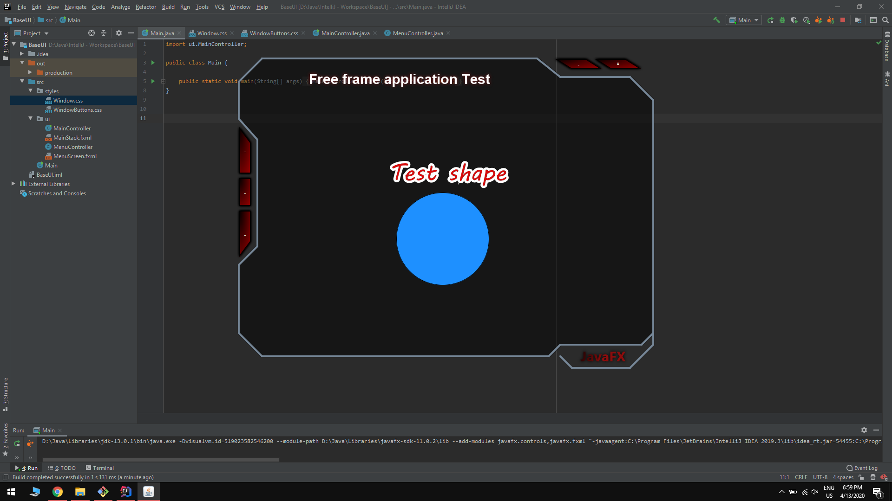

# Window template (base UI)

> Application is non rectangle window template for futures applications.

## Project screenshots

	
## Window has implemented: 
* non rectangle window shape;
* semi-transparent window inside;
* separated layout pane for title and main content;
* base functions as minimize and close window;
* CSS styles;

## To do (development ideas):
* implementing resizable class

## Requirements (will be changed):
The window template was created and tested on Windows 10 with 1920x1080px screen resolution.
* Java SE 13
* JavaFX 13

## Contact
Created by Mateusz Łyszkiewicz  
mat.lyszkiewicz@gmail.com
